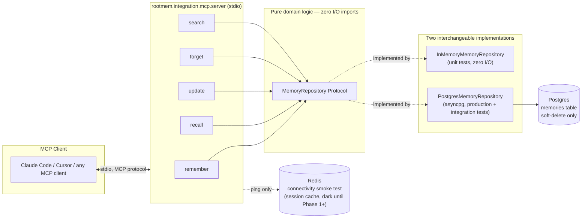

# ROOTMEM

**A human-brain-inspired, MCP-native memory system for AI agents.**

[](https://github.com/m1r4g3-code/rootmem/actions/workflows/ci.yml)


ROOTMEM gives an AI coding agent (Claude Code, Cursor, or anything else that
speaks MCP) a real, persistent memory — one that survives process restarts,
new chats, and new machines, instead of evaporating the moment a context
window ends. This repository is a **chartered, multi-phase build**, now
through Phase 4: thirteen MCP tools over a real Postgres store, with a
semantic graph, consolidation into skills and lessons, multi-factor ranking
with decay and trust, and a tamper-evident audit log — each phase proven over
the actual protocol, not just in unit tests. The sections below describe the
Phase 0 foundation the later phases build on; see Status for the full arc.

## Why this codebase is worth a second look

Most weekend MCP-server projects stop at "it imports `asyncpg` and calls
`await conn.execute(...)` from inside the tool handler." That works until
you try to write a test, at which point you either need a live database for
every test run or you don't test the handler logic at all. This project
made a different call early and paid for it immediately:

- **The storage layer is a `typing.Protocol`, not a driver import.**
  Every tool handler depends on `MemoryRepository` — an abstract interface
  with `create` / `get_by_id` / `get_by_key` / `update` / `soft_delete` /
  `search_text` — never on `asyncpg` directly (see
  [ADR 0003](docs/adr/0003-storage-repository-protocol.md)). Two
  implementations exist: an in-memory fake for unit tests and a real
  `asyncpg`-backed one for production and integration tests.

- **One contract, two backends, enforced by inheritance.** The exact same
  test suite (`tests/unit/storage/contract.py`) runs against both
  implementations — subclass it once for the fake, once for real Postgres,
  and both are held to identical behavioral guarantees. This isn't a
  theoretical nicety: it's what caught the two real bugs below.

- **Real bugs, caught before they shipped, not after.** Running the
  contract suite against an actual Postgres instance (not the fake)
  surfaced two defects the in-memory tests structurally could not see:
  a `confidence` column declared `REAL` (32-bit float) that silently
  corrupted values like `0.9` into `0.8999999761581421` on round-trip
  (fixed to `DOUBLE PRECISION`), and a malformed-UUID lookup that crashed
  as an opaque `StorageError` instead of behaving like "not found," the way
  the fake naturally does. Both are fixed, both are now permanently pinned
  by the contract suite. This is the entire argument for testing against a
  real backend, demonstrated rather than asserted.

- **Soft-delete is the only delete, and it's verified at the database
  layer, not just through the app's own read path.** `forget` never issues
  `DELETE`. It sets `deleted_at` / `deleted_reason` and nothing else touches
  the row. A dedicated integration test bypasses the repository entirely
  and inspects the raw row with a direct SQL query, because "the code that
  claims to soft-delete says it soft-deleted" is a weaker guarantee than
  "the row is still physically there" (see
  [ADR 0004](docs/adr/0004-forget-soft-delete-scope.md)).

- **Every non-obvious decision is a written ADR, not tribal knowledge.**
  Five of them so far, each with real context, a decision, and rejected
  alternatives — including one documenting a wrong assumption caught and
  corrected against the actual installed package version rather than left
  wrong in the docs (see [ADR 0002](docs/adr/0002-mcp-sdk-and-stdio-transport.md)).

- **`mypy --strict` passes across the whole `src/` and `tests/` tree, with
  zero suppressions.** Not "mostly typed." Not `# type: ignore` sprinkled
  where inference got hard. Every public function signature, every
  Pydantic model, every repository method — fully typed and checked.

- **The schema degrades gracefully instead of hard-failing on missing
  infrastructure.** `pgvector` has no simple Windows binary install. Rather
  than making the whole project Docker-only, the init migration detects
  whether the extension actually loaded and conditionally creates the
  `content_embedding` column — one migration file, correct against a
  full docker-compose Postgres *or* a bare native install, with zero
  branching in application code.

- **The exit criterion was a real, human-observed, cross-session test —
  not a green checkmark.** Phase 0's charter defines success as "an agent
  remembers a fact across two separate sessions via MCP." That was
  validated with two genuinely independent Claude Code processes, sharing
  one persisted fact through this server, then exercised through `update`,
  `forget`, and a direct-database soft-delete check. The full log — exact
  timestamps, exact prompts, exact returned values — is in
  [`scripts/manual_recall_check.md`](scripts/manual_recall_check.md).

None of this is decoration. It's what "production-grade" costs, paid up
front, on a project small enough that most people wouldn't have bothered.

## Architecture



Tool handlers never see a connection object, a SQL string, or an `asyncpg`
type — only the `MemoryRepository` protocol. That boundary is what makes
`tests/unit/` run in milliseconds with no external services, and what makes
`tests/integration/` a genuine end-to-end proof rather than a slower copy of
the same unit tests.

## The tools

The five below are the Phase 0 core. Later phases added `ingest_session`,
`related`, `consolidate`, `feedback`, `find_skill`, `get_skill`,
`report_skill_outcome` and `verify_audit` (13 in total); `search` now returns
hybrid text+vector results re-ranked by relevance, decay, salience, source
trust and graph proximity, each with a per-term score breakdown.

| Tool | Contract |
|---|---|
| `remember` | Persist a new memory. Idempotency-key collisions return the existing record instead of duplicating. |
| `recall` | Fetch one memory by `id` or `key`. Returns `found: false`, never an error, when nothing matches. |
| `update` | Partial update (`content` / `confidence` / `metadata`) to a non-deleted memory. |
| `forget` | Soft-delete. Idempotent — forgetting an already-forgotten memory returns its existing deletion timestamp instead of raising. |
| `search` | Ranked full-text search (`ts_rank` over `to_tsvector`) across non-deleted memories in a namespace. |

## Quickstart

**Prerequisites:** Python 3.13, [uv](https://docs.astral.sh/uv/), and either
Docker Desktop or a native Postgres 17 + Redis install.

```bash
uv sync --all-extras --dev
cp .env.example .env          # adjust if needed
docker compose up -d          # Postgres+pgvector, Redis
uv run python scripts/migrate.py
uv run python -m rootmem.integration.mcp.server   # serves over stdio
```

**No Docker?** The app talks to Postgres/Redis only through `.env` config —
run Postgres 17 and Redis however you like, point `.env` at them, then
`uv run python scripts/migrate.py`. The init migration skips `pgvector`
gracefully if it isn't installed (Phase 0 doesn't populate embeddings yet).
Full detail on the native path this project itself used — including the
exact fallback for a Windows box where pgvector has no binary install — is
in [`scripts/manual_recall_check.md`](scripts/manual_recall_check.md).

**Point an MCP client at it:**

```bash
claude mcp add rootmem -- <path-to-venv>/python -m rootmem.integration.mcp.server
```

or add it to `.mcp.json` / your client's MCP config directly. See
[`scripts/manual_recall_check.md`](scripts/manual_recall_check.md) for the
exact cross-session validation procedure this project ran to sign off
Phase 0.

## Development

```bash
uv run ruff check .                 # lint
uv run mypy --strict src/ tests/    # type-check — zero errors, zero ignores
uv run pytest tests/unit -v         # 31 tests, no external services required
uv run pytest -m integration -v     # 23 tests — real Postgres, real Redis, real MCP subprocess
```

`tests/integration/test_mcp_server_e2e.py` is not a mock of the protocol —
it launches the actual server as a subprocess over real stdio and drives it
through the real `mcp` client library, the same way Claude Code or Cursor
would. All 54 tests are green.

## Documentation map

This project follows a chained, phase-by-phase SDLC: research memo →
requirements → ADRs → implementation → retro, for every phase, before the
next phase is even planned.

- [`docs/research/phase0-research-memo.md`](docs/research/phase0-research-memo.md) — landscape survey and rationale behind the Phase 0 scope cut.
- [`docs/requirements/phase0-requirements.md`](docs/requirements/phase0-requirements.md) — the requirements this phase was actually built against.
- [`docs/adr/`](docs/adr) — five accepted ADRs covering the graph-store deferral, the MCP transport choice, the storage protocol, the soft-delete scope, and the tooling stack.
- [`docs/math-spec/`](docs/math-spec) — formal spec for anything with actual math in it (ranking, decay — mostly reserved for later phases).
- [`scripts/manual_recall_check.md`](scripts/manual_recall_check.md) — the literal, timestamped sign-off log for the human-observed exit criterion.

## Project layout

```
src/rootmem/
  storage/            MemoryRepository protocol (protocols.py), the in-memory
                       fake, and the Postgres implementation      — ADR 0003
    postgres/         asyncpg repository + yoyo migrations
    redis/            connectivity-only client, protocol=2 pinned
    fakes/            InMemoryMemoryRepository — zero I/O, unit-test backend
  integration/mcp/    the 5 tools + the stdio server that wires them up — ADR 0002
  observability/      per-operation latency/outcome logging
  retrieval/          reserved for Phase 4's multi-factor ranking formula
  capture/            reserved for later-phase capture pipeline
  extraction/         reserved for later-phase entity/relation extraction
  consolidation/      reserved for later-phase memory consolidation ("dreaming")
  trust/              reserved for later-phase provenance/trust scoring
docs/                 research memos, requirements, ADRs, math specs — one set per phase
tests/
  unit/               fast, no external services
  integration/        real Postgres + Redis + a real MCP subprocess
```

The empty-looking `capture/` / `extraction/` / `consolidation/` / `trust/`
directories are not filler — they're placeholders with their own READMEs so
later phases add files into an already-agreed layer boundary instead of
restructuring the package around code that didn't anticipate them.

## Status

**Phase 0 — Foundations: complete.** All 54 automated tests pass; the
manual cross-session exit criterion is validated and logged. See
[`scripts/manual_recall_check.md`](scripts/manual_recall_check.md) for the
full sign-off record, including the two real bugs the integration suite
caught before they could ship.

| Phase | Tag | Delivered |
|---|---|---|
| 0 | `v0.0.1-phase0` | Foundations: five tools, Postgres, soft delete |
| 1 | `v0.1.0-phase1` | Semantic graph, vector retrieval, extraction |
| 2 | `v0.2.0-phase2` | Consolidation, salience, Bayesian belief |
| 3 | `v0.3.0-phase3` | Procedural memory, failure-to-lesson, SKILL.md |
| 4 | `v0.4.0-phase4` | Ranking, decay, trust, tamper-evident audit log |

Each phase has its own research memo, requirements, ADRs, exit-criterion
test and manual sign-off log under `docs/` and `scripts/`. Ranking weights,
decay stability and trust reliabilities are provisional defaults, not tuned
on real usage. Cross-instance identity and remote transport are not built.
